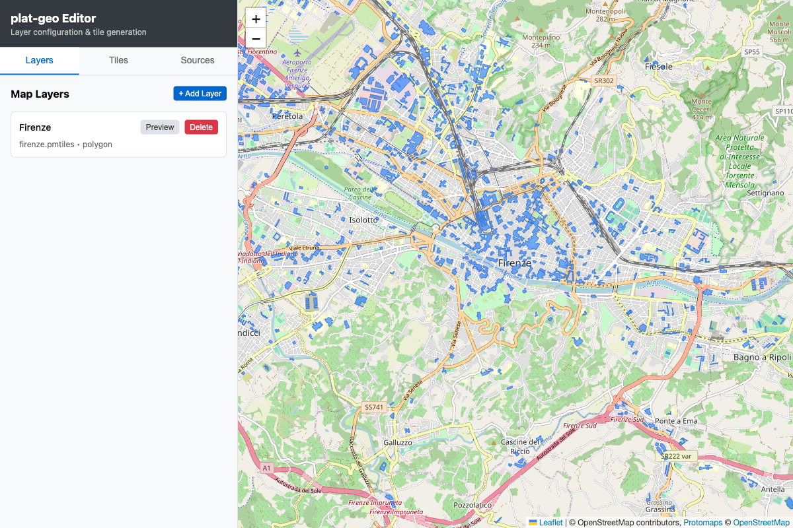
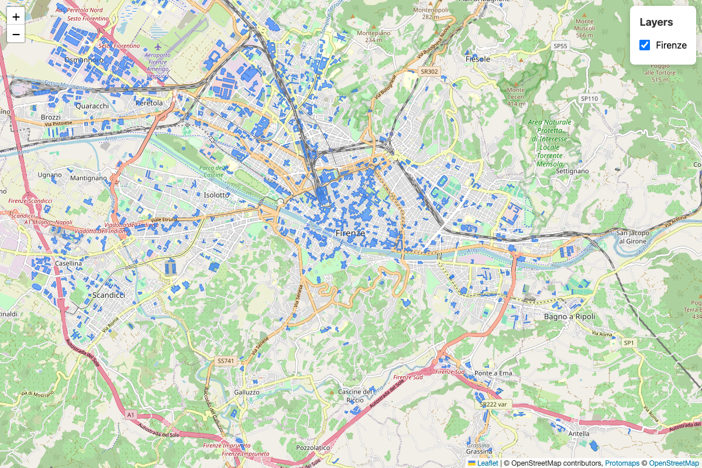
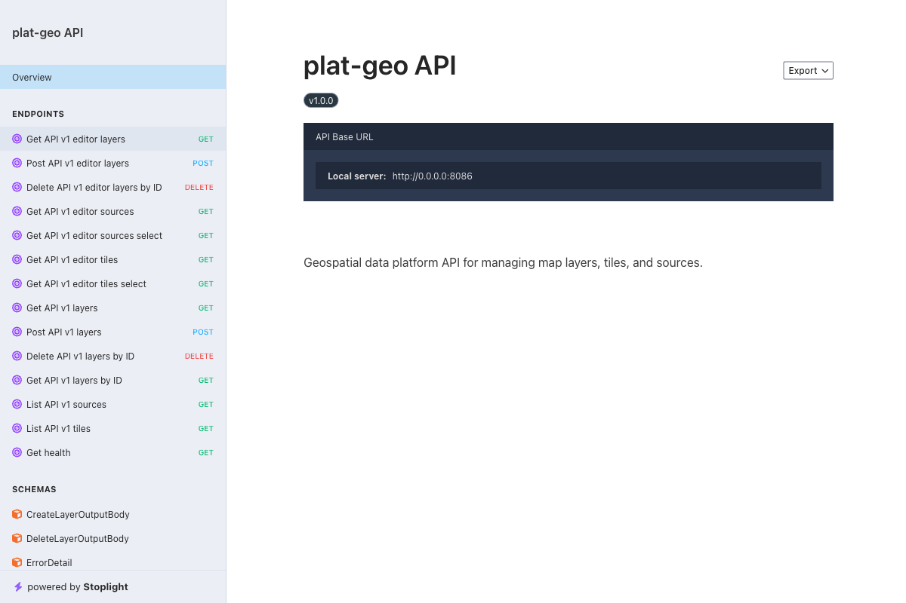

# plat-geo

Geospatial data platform with PMTiles and GeoParquet.



## Install

```bash
xplat pkg install plat-geo
```

## Run

```bash
geo serve
```

Open http://localhost:8086/editor

## Development

```bash
xplat task dev
```

## Screenshots




